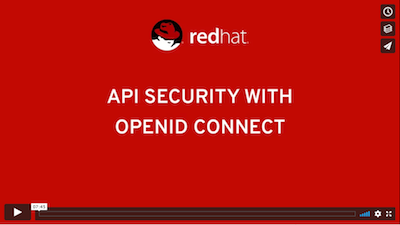
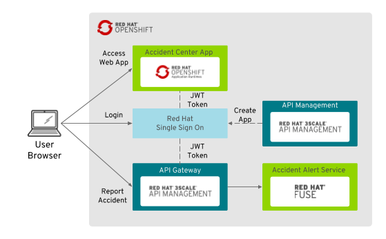

# API Security with OpenID Connect

## Introduction

_Securing APIs with OpenID Connect using 3scale API Management and Red Hat Single Sign On_ demo is a multi-product demo showing how Red Hat 3scale API Management and Red Hat Single Sign On can be use to evolve APIs security.

**Products and Projects**

* OpenShift Container Platform
* Red Hat 3scale API Management
* Red Hat Single Sign On
* Red Hat Fuse
* Red Hat AMQ

**Provisioning Time:** ~15 min

**Guide:**

**Video:**

[](https://vimeo.com/259970326 "API Security with OpenID Connect - Click to Watch!")

**Credentials**

Red Hat Single Sign On
  
* Username: **keyadmin**
* Password: **keypassword**

3scale API Management

* Username: **admin**
* Password: **password**

Web Application

* Username: **statepolice**
* Password: **password**

**Github Repo:** http://github.com/jbossdemocentral/3scale-security-oidc-demo

## Background

Shadowman Insurance Corporation is one of the largest insurance providers in the country. Shadowman Insurance primarily offers its services through the Internet and through partner independent insurance agents. To stay competitive, they decide to start the new "Digital transformation Project" by transforming their entire business and organizational activities, processes to fully leverage the digital technologies. 

### Accident Alerts

Shadowman Insurance accident customer helpdesk center collects external reports of the clients and send them back to Shadowman daily. The company wants to enable police and fire departments access to the accident alert center web application. Currently that application is used by the helpdesk from the internal (VPN) network. As much as Shadowman Insurance's urgency to provide these capability, they were also concern about the security of the service they provide. No compromise when it comes to the safty of the client data and it's system.

### API Security

Shadowman Insurance CSO (Chief Security Officer) requested that all external facing services be compliant with the corporate security policy. Currently the web application is using Red Hat Single Sign On to secure the Accident Alert Center Portal. In this demo the backend REST service will be integrated with the Alert Center portal using an API Gateway secured service instead of the legacy unsecured endpoint.

## Demo Objectives

* Disable external access to backend service
* Configure 3scale service to receive POST methods on the internal backend service endpoint
* Update Alert Center Portal web application with the secured code using RH SSO Javascript adapter
* Update the deploy configuration with the new build of the Alert Center Portal using the gated backend service endpoint
* Show the 3scale service analytics after posting reports using the gated service
* OPTIONAL - update the application plan to rate-limit the application



## Installation

Follow this instructions to setup a working demo environment.

### Prerequisites

* OpenShift Container Platform 3.6
* User with cluster-admin role
* OpenShift router with [support for wildcard routes](https://docs.openshift.com/container-platform/3.6/install_config/router/default_haproxy_router.html#using-wildcard-routes) 

## Deployment

1. Setup the environment. Login as a cluster admin and create the required templates.

    ```
    $ oc login -u system:admin
    $ oc create -f https://raw.githubusercontent.com/jboss-openshift/application-templates/ose-v1.4.7/jboss-image-streams.json -n openshift
    $ for i in {https,mysql,mysql-persistent,postgresql,postgresql-persistent}; do oc create -f https://raw.githubusercontent.com/jboss-openshift/application-templates/ose-v1.4.7/sso/sso71-$i.json -n openshift; done
    ```

1. Create project for Red Hat Single Sign On.

    ```
    $ oc new-project rh-sso --display-name='Red Hat Single Sign On'
    $ oc create -f https://raw.githubusercontent.com/jboss-openshift/application-templates/ose-v1.4.7/secrets/sso-app-secret.json -n rh-sso
    $ oc policy add-role-to-user view system:serviceaccount:rh-sso:sso-service-account
    $ oc new-app sso71-mysql-persistent -p HTTPS_NAME=jboss -p HTTPS_PASSWORD=mykeystorepass -p SSO_ADMIN_USERNAME=keyadmin -p SSO_ADMIN_PASSWORD=keypassword
    ```

1. Create project for API Implementation.

    ```
    $ oc new-project service --display-name='Alert Center Backend Service'
    $ oc process -f https://raw.githubusercontent.com/jbossdemocentral/3scale-security-oidc-demo/master/support/templates/amq63-basic-template.json -p MQ_USERNAME=admin -p MQ_PASSWORD=admin | oc create -f -
    $ oc process -f https://raw.githubusercontent.com/jbossdemocentral/3scale-security-oidc-demo/master/support/templates/accidentalert-backend-template.json -p APP_NAME=accidentalert-backend -p GIT_REPO=https://github.com/jbossdemocentral/3scale-security-oidc-demo.git -p GIT_REF=master -p CONTEXT_DIR=/projects/myaccidentalert -p ACTIVEMQ_BROKER_USERNAME=admin -p ACTIVEMQ_BROKER_PASSWORD=admin -p CPU_REQUEST=1 -p MEMORY_REQUEST=512Mi -p MEMORY_LIMIT=1024Mi | oc create -f -
    ```

1. Create project for ui app. Replace the URL env vars with your actual environment hostnames.

    ```
    $ oc new-project www
    $ oc process -f https://raw.githubusercontent.com/jbossdemocentral/3scale-security-oidc-demo/master/support/templates/accidentalert-ui-template.json -p SSO_URL='https://secure-sso-rh-sso.apps.d2a7.openshift.opentlc.com' -p BACKEND_URL='http://accidentalert-backend-service.apps.d2a7.openshift.opentlc.com' -p APPLICATION_HOSTNAME='www-accidentalert-ui.apps.d2a7.openshift.opentlc.com' | oc create -f -
    ```

1. Create project for 3scale.

    ```
    $ oc new-project threescale
    $ oc new-app -f https://raw.githubusercontent.com/3scale/3scale-amp-openshift-templates/2.1.0-GA/amp/amp.yml --param WILDCARD_DOMAIN=amp.apps.d2a7.openshift.opentlc.com --param ADMIN_PASSWORD=password --param WILDCARD_POLICY=Subdomain
    ```

## Config

1. Import the insurance [realm](support/templates/insurance-realm.json) into Red Hat Single Sign On.
1. Add role 'manage-clients' to the 3sale-admin client's service account.
1. Write down the service account secret.
1. Create the backend service in 3scale. 
    1. Select OIDC as authentication mechanism.
    1. Set name "Accident Report API"
    1. Set system name "accidentalert"
1. Create an application plan.
    1. Set name "Law Enforcement"
    1. Set system name "lawenforcement"
    1. Publish the plan
1. Config the backend service API.
    1. Fill in the Private Base URL with the backend service OpenShift route.
    1. Fill in the information of the RH SSO endpoint for 3scale zync.
1. Create the accidentalert-ui application.
    1. Set description "Accident Report Web Application"
    1. Set name "Accident Report App"
1. Make the application client public in RH SSO.
1. Update the application clientId in the web ui code.

### Support & Ownership

Feel free to ask [Hugo Guerrero](https://github.com/hguerrero) if you need some support when there are any questions left or if you need some support.
