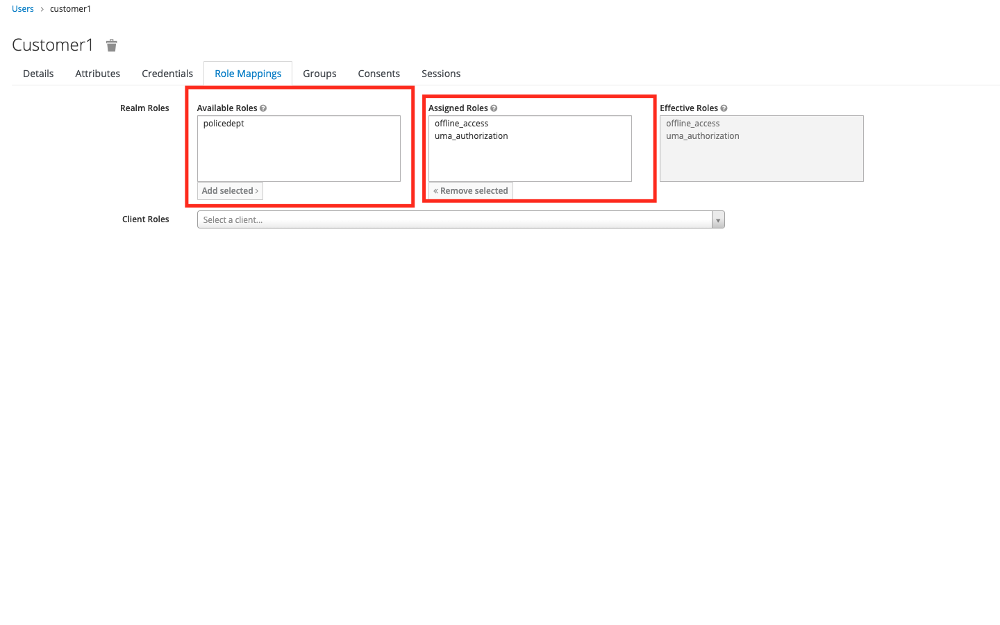

//attributes
:title: Scenario 1 - Creating a secure login using Red Hat SSO

[id='3scale-security-demo'] 
= {title}

//Description text for Solution Pattern
This tutorial demonstrates how to provide a secure access to the accident reporting app without embedding the authentication logic in our application. This is more secure and saves developers a ton of time as they would be using a standard protocol such as OpenID Connect and the proven product such as Red Hat SSO. Red Hat SSO and is already deployed and configured for us on OpenShift.

*Credentials:*

*OpenShift Username*: Use your Red Hat associate SSO credentials to log into the OpenShift console

*OpenShift Password*: Use your Red Hat associate SSO credentials to log into the OpenShift console

[time=2]
[id="logging-in-to-the-web-app"]
== Logging into the accident reporting app

. Launch a new a tab on the browser
. Navigate to the OpenShift console link provided in the email
. Choose the Red Hat associate option
. Login using your *Red Hat associate SSO Credentials*
. Click on Topology > Select the project that starts with www (This is the project for the front end of our application deployed on OpenShift)

. Click on the external route of the reporting application to access it
+

. Click on *Accidents > Login to file a report* 
+

. On the login screen enter the credentials that were pre-created for the purpose of this lab using Red Hat SSO:
 ** Username: *statepolice*
 ** Password: *password*
+

. Fill all the mandatory fields to submit a report. You should see a success message like the one shown below for a legitimate user:
+

[time=2]
[id="exploring-sso"]
== Exploring the user configuration in RH SSO

In this section we will explore the configurations in RH-SSO that enabled the user 'statepolice' to login and file a report.

. Go the Openshift Console > Topology view, choose the project name starting with 'sso'
. Click on the route of the keycloak pod to access the admin console of RH-SSO
+

. Click on admin console to go to login screen of RH SSO
+

. Navigate to Secrets > Select the sso project > Search for credential in the search bar and click on the 'credential-sso'
+

. Copy and paste the admin user name and password from the data section and login to the SSO-admin portal
+

+

. Insurance is the pre-configured realm that we will be using for this excercise. 
+
_A realm is a space where you manage objects, including users, applications, roles, and groups. A user belongs to and logs into a realm_.
+

. Navigate to Users > view all users > click on the ID of the statepolice user to go to the details screen if the user
+

. Navigate to Users > view all users > click on the ID of the statepolice user to go to the details screen if the user
+

. Click on the role mappings tab and check the Assigned Roles section. The user has been assigned a role named *policedept* that will enable them to login and file an accident report. Any user who is assigned this role can submit the report 
+

Click here to proceed with the next sceanrio or continue with the optional section below.

[time=2]
[id="addtional-user"]
== Creating a new user using RH-SSO (Optional)

In this section we will explore how to create a new user for our accident alert app using RH-SSO.

. Log on to RH-SSO based on the steps described in the above section and Navigate to Users > Add User 
+

. Create a user with Username `customer1` 
+

. Click on the credentials tab on the user details page and set a password for the user *customer1* . Set the password as `password` for purpose of this lab. Remember to turn off the Temporary option before clicking on set password button.
+

. Now click on the role mappings tab and check the Assigned Roles section. The user has *not* been assigned the *policedept* role that is required to login and file an accident report. Any user who is not assigned this role *cannot submit the report* 
+

. Try logging in to the accident portal using the new credentials (username: `customer1` and password: `password`) using an incognito window. You should see an error message as this user doesn't have enough permissions to perform this actions
+

. Navigate back to the SSO admin portal and add *policedept* under the assigned roles for *customer1*. Now go back to our web app and refresh the browser. You should now be able to submit a report using *customer1* as the user
+

Click next to proceed with the next scenario.
