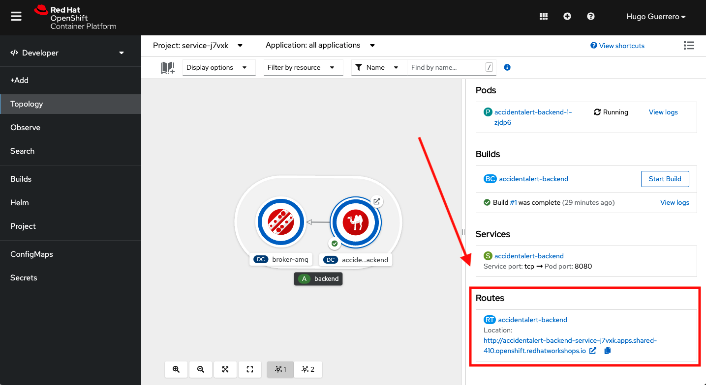
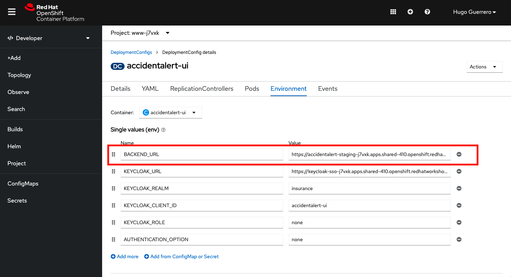
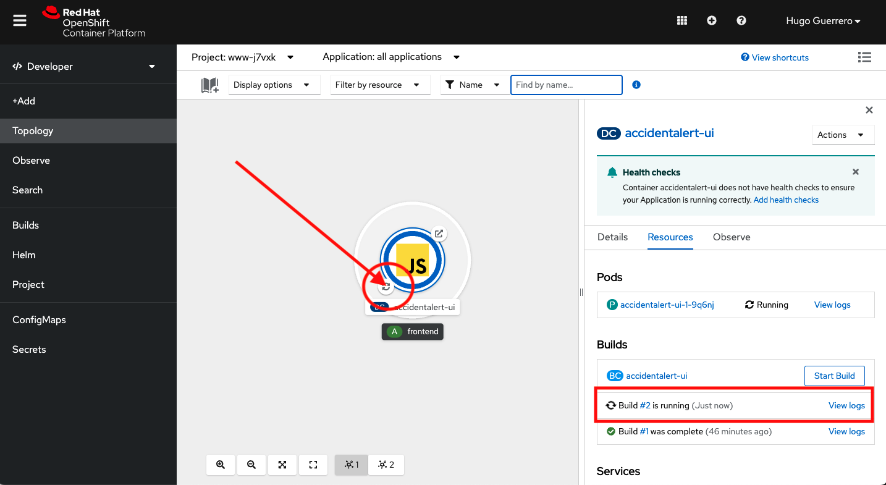
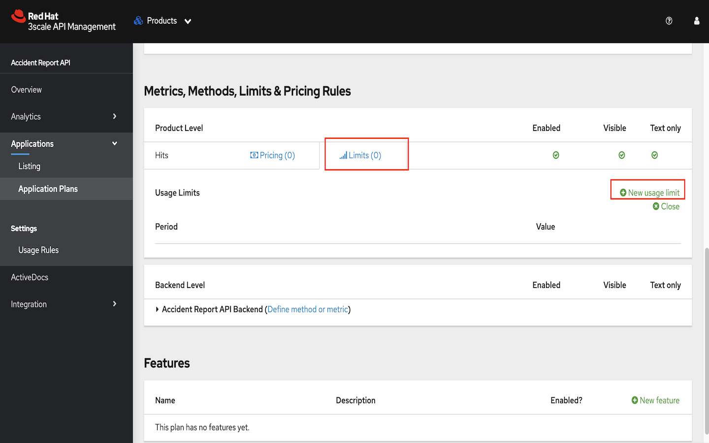
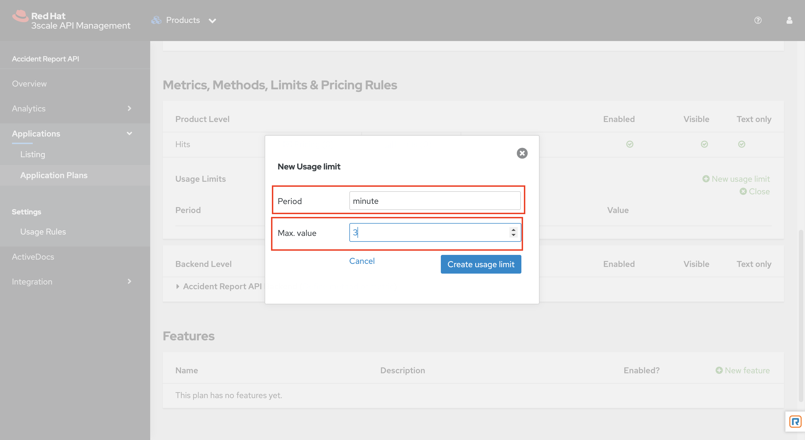

//attributes
:title: Scenario 2 - Protecting the backend with Red Hat 3Scale API Management

[id='3Scale-security-demo'] 
= {title}

//Description text for Solution Pattern
In the previous section we've learnt how to protect our front-end from unauthorised users by using RH-SSO. However the backend of our application is still unprotected and anybody with an access to the public url of our backend can access it and make HTTP requets. In fact, our back-end is still publicly available and doesn’t check for any authentication, nor authorization. This is not ideal. This tutorial demonstrates how we can  provide a secure access to our backend only to authorised applications using Red Hat 3Scale API management. 

*Credentials:*

OpenShift Username: _Use your OPENTLC credentials to log into the OpenShift console_

OpenShift Password: _Use your OPENTLC credentials to log into the OpenShift console_

3Scale Admin Username: _You can find these details in the lab setup email_

3Scale Admin Password: _You can find these details in the lab setup email_ 

*Prequisites:*

Install postman on your local machine or you can register for a free account https://identity.getpostman.com/signup[here]

[time=2]
[id="delete-backend-route"]
== Deleting the public route of the backend 

. Launch a new a tab on the browser
. Navigate to the OpenShift console link provided in the email
. Click on Topology > Select the project that starts with 'service' (This is the project for the backend of our application deployed on OpenShift). Click on the backend pod to find the details and public url of the backend
+

+

. Copy the url under routes and append '/accidentcenter/report' to it. Create a POST request on Postman using this newly created URL. Donot forget to copy and paste this payload in the Body > raw field but you hit the send button.(This is basically the same information that we fill in the web UI form)
+

. The backend returns a success message to Postman.
+

. Verify if the backend received the POST call. To access the logs of our backend navigate select the backend project on OpenShift and Navigate to Topology > Backend pod > View logs
+

+

This shows that anyone with the public route of the backend can directly access and send requests to it.

. To avoid this delete the Route that provides the public access to our backend. Access the route by navigating to the pod deailts screen on OpenShift
+
image::images/backend-route-click.png[backend-route-click]

. Delete the route.
+

. Make another request via postman now. You will see that the backend cannot be reached anymore.
+

+
However this also breaks our web app as it was making a plain ajax call to call the backend (Look at the frontend code snippet below). Refresh the web app and try submitting a new report. You will not be able to submit the report. You can cross check the same by monitoring the backend logs while you make the new request. 
+

[time=2]
[id="securing-apis"]
== Providing secure access to the backend with 3Scale API Management

We are now in a very unsatisfactory situation. We have secured our end-point, but we can’t access it anymore from our application. So, now we have two main options:
 
 ** We could find a way to restrict the access to the back-end in the sense that only the front-end can access it. The downside for this approach is that the front-end runs in a relatively unsecure place in the browser. This could actually be achieved by concepts like “Cross Origin Resource Sharing” (CORS), but is not recommended.
 
 ** We could add an API Management layer that is located close to the back-end. This would also give us more flexibility to manage rate limits, monitor traffic, etc.
 
 
. Login to 3Scale and click the 'X' icon on the welcome page to see the admin dashboard
+

. An API product with the name 'Accident Report API' has already been created for the purpose of this lab. Click on the 'Accident Report API' under products
+
[NOTE]
====
A 3Scale api product is a bundle of one or more API backends. Products facilitate the creation of strong and simplified offerings for API consumers. A product can contain multiple backends.
====
+

. Navigate to Integration > Backends > Click on the 'Accident Report Api' backend
+

. Click on edit on the top right corner and change the value of the private base URL to the internal host name of the backend service i.e. http://[Service-name].[Namespace of Back-end Service].svc:8080. Click on 'Update Backend'
+

+
To retrieve the the Service name and Namespace from OpenShift go to Topology > Click on the backend service > Click on service name
+

+

+
[NOTE]
====
This service will only be accessible within the OpenShift Cluster. 3Scale API gateway is also deployed on the same cluster so that it can access this backend service via it's service hostname.
====

. Navigate to Products (Accident Report API) > Integration > Mapping Rules > Click on edit the button
+

. Navigate to Products (Accident Report API) > Integration > Mapping Rules > Click on edit the button
+

. Change the verb to 'POST as we will be sending data to the backend. The mapping rules let us mask 'Verbs' as patterns. In our case any POST request that hits the '/' of the path of the service will increment the no. of hits to the backend. 
+

. Navigate to Application > Application Plans > Law Enforcement to verify the application plan available. The Law Enforcement application plan has been pre created for the purpose of this lab.
+
[NOTE]
====
Application Plans define the different sets of access rights you might want to allow for consumers of your API. These can determine anything from rate limits, which methods or resources are accessible and which features are enabled.
====
+

. Now, promote this new Product to the “Staging” Environment.Click on “Integration” -> Configuration -> “Promote v.x to Staging APIcast”
+

. Developers can create applications with unique IDs and secrets for accessing the API. In our case the Accident Report Front end is the application that would need access to the backend. Go to Audience > Application > Listing > Accident Report App to verify the details. The app and all the details have been pre created for the purpose of this lab. Check out these steps to see a detailed explanation on how to create a 'app' in 3Scale.
+

+

. For this demo we've chosen RH-SSO for authenticating an application can access our backend. Verify this by navigating to Product > Integration > Settings
+

+
[NOTE]
====
3Scale also provides three different ways of authentication for a product:

** API Key (user_key) The application is identified & authenticated via a single string. (If a hacker or unauthorise user gets hold of this key, they can access our backend)

** App_ID and App_Key Pair The application is identified via the App_ID and authenticated via the App_Key.

** OpenID Connect Use OpenID Connect for any OAuth 2.0 flow. (We've used this method in our lab)
====

. As a result of the above configuration 3Scale automatically syncs the  with RH-SSO. From RH-SSO admin console navigate to Clients and verify the app ('accidentaler-ui' in our case) is created. Click on it to verify the all the application configuration details such as the description, Valid Redirect URIs and Web Origin have the same values as we provided in 3Scale.
+

+

+
image::images/3scale-app-details.png[3scale-app-details]

[time=2]
[id="rebuilding-frontend"]
== Rebuilding the front end app to authenticate using RH-SSO

. Recollect that our frontend application code makes a plain ajax call to access the backend. We need to modify the code so that it uses RH-SSO to get the token and inject it. First let's verify the front end code that makes the plain ajax call by clicking https://github.com/jbossdemocentral/3scale-security-oidc-demo/blob/2adc1c90b94212975a10c038678741fb7307ece9/projects/accidentalert-ui/templates/src/accident.html#L369[here]
+

. Navigate to the "secured" branch of this repository. The frontend code has been modified to use the RH-SSO token. https://github.com/jbossdemocentral/3scale-security-oidc-demo/blob/f30746c4a492150cd017f04c8c5dd24d0518f235/projects/accidentalert-ui/templates/src/accident.html#L374[Line 374] 
+

+

+
We now need to rebuild the front end application using the new code form secured branch on OpenShift.

. In OpenShift Console, go to the “www”-project > Builds and in the existing “Build-Config” click “Edit Build Config”
+

. In the “YAML” line 89 change the ref(branch) from  master to secured
+

. In order to let the UI also point to the API Gateway (and not the back-end route), we also have to change the environment variable of the build
Go to tab “Environment” and change the value of BACKEND_URL to that of the API Gateway (Staging) provided in 3Scale and save it. 
+
Copy this URL from 3Scale and paste in OpneShift
+

+

. Choose “Actions->Start Build”
+

. Go to “Developer perspective -> Topology” and click on the “accidentalert-ui” icon
(You can see that the build is running which takes a bit.) Wait until the new version is deployed
(You can also see that under Details -> “Latest version” has been changed to “2”)
+

+
image::images/build-live.png[build-live]

. Test the new application version from the Web GUI. Do a refresh of the “Shadowman Insurance” page. Click on Accidents -> “Log in to file a report”. Before you click on submit right click > inspect to monitor the network(api calls) that the front end is making.
+

. From the network calls we can see that the front end is calling the 3Scale API Gateway
+

. Copy the request url and try making a call to the backend via postman. You should see an authentication error such as the one below. In this way  we have secured our backend and provided a secure way for the frontend to access it using 3Scale and SSO
+
image::images/postman-auth-fail.png[postman-auth-fail]

[time=2]
[id="monitoring-apis"]
== Monitoring APIs with RH 3Scale

3Scale admins can monitor the the usage of different APIs using the analytics provided and also put some rate limits to restrict access to this APIs. We shall explore them in this section

. From 3Scale admin dashboard navigate to Accident Report API > Analytics > Traffic. We can see the the information about no.of hits to the APIs, the daily averages, response/error code analytics etc in the analytics section
+

*One can also restrict the number of calls an application can make by setting limits in the application plans*. 
+
. From 3Scale admin dashboard navigate to Accident Report API > Applications > Application Plans > Click on the Law Enforcement appication plan. 
+

. Click on Limits > New Usage limit to add a new usage limit to our API.
+

. Change the period to minute and Max value to 3. Click on  Create Usage limit. This means that we are giving instructions to 3Scale to limit the number of calls to this API from our front end application to 3 per minute. 
+

. Now let's test this out by making more than 3 calls with a minute from our front end app. Navigate to our accident report app. Right click mouse to inspect the the network call and reponse codes as we illustrated in one of our earlier steps. Submit more than 4 to 5 reports with a minute.  
+

.  After the number of submissions within a minute have crossed 3 you should see a failed request with a status code 429 in your network tab
+

.  Click on the report with status 429 to see the details. The status code description should say too many requests. This shows that our usage limit has kicked in to restrict the number of calls from a particular application. This is particualrly useful when someone is trying to exploit your APIs by making too many requests and also for monetization purposes.
+

